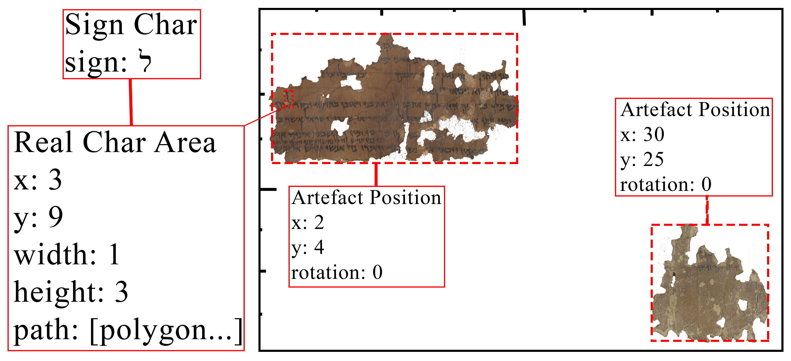

- [Introduction](#introduction)
  - [Creating a scroll in the SQE Database](#creating-a-scroll-in-the-sqe-database)
    - [scroll table](#scroll-table)
    - [scroll\_version\_group table](#scroll_version_group-table)
    - [scroll_version table](#scroll_version-table)
  - [Detailed scroll data input/output](#detailed-scroll-data-inputoutput)
    - [scroll_data table](#scroll_data-table)
    - [scroll\_data\_owner table](#scroll_data_owner-table)
  - [Data creation/deletion and tracking](#data-creationdeletion-and-tracking)
      - [Summary](#summary)
  - [Textual data](#textual-data)
    - [sign table](#sign-table)
    - [sign_char table](#sign_char-table)
    - [sign\_char\_attribute table](#sign_char_attribute-table)
    - [attribute_value table](#attribute_value-table)
    - [attribute table](#attribute-table)
    - [position\_in\_stream table](#position_in_stream-table)
    - [linking signs to words, lines, columns, and scrolls](#linking-signs-to-words-lines-columns-and-scrolls)
  - [Image data](#image-data)
    - [SQE_image table](#sqe_image-table)
    - [image_urls table](#image_urls-table)
    - [image_catalog table](#image_catalog-table)
  - [Binding text to image](#binding-text-to-image)
  - [user/permissions system](#userpermissions-system)
      - [sessions](#sessions)

# Introduction

The SQE database is a relational database containing data pertaining to text transcriptions, related image data, and other cataloging/bibliographical information.  If you do not know what a relational database is, see [here](https://mariadb.com/kb/en/library/introduction-to-relational-databases/), or [here](https://en.wikiversity.org/wiki/Introduction_to_Relational_Databases).  This tutorial assumes you know the basics of `tables`, `columns`, and `rows` in a database and the use of `primary key`s for addressing entries and `foreign key`s for linking entries.  It is also important to understand the two main types of relationships in a relational database: `one to many` and `many to many`.  An online commented schema for the database can be accessed [here](https://qumranica.org/database).

## Creating a scroll in the SQE Database

The SQE database often makes use of abstract placeholders to link data that can can changed due to editor decisions.  A primary example of this is the table [`scroll`](https://qumranica.org/database/tables/scroll.html).  This table is nothing more than a single column list of `ID`s:

### [scroll](https://qumranica.org/database/tables/scroll.html) table

|scroll_id|
|:--:|
|1|
|2|
|3|
|4|
|5|

All data for a reconstructed scroll is ultimately linked to a `scroll_id` in the [`scroll`](https://qumranica.org/database/tables/scroll.html) table.

Let's start with the basics, every scroll created by a user (including all the initial scrolls created from QWB data) is treated as a [`scroll_version`](https://qumranica.org/database/tables/scroll_version.html) which is part of a [`scroll_version_group`](https://qumranica.org/database/tables/scroll_version_group.html).  The [`scroll_version_group`](https://qumranica.org/database/tables/scroll_version_group.html) table is used to store information regarding the sharing of [`scroll_version`](https://qumranica.org/database/tables/scroll_version.html)s among users (more on that a little later).

### [scroll\_version\_group](https://qumranica.org/database/tables/scroll_version_group.html) table

|scroll\_version\_group_id|scroll_id|locked|
|:--:|:--:|:--:|
|1|1|1|
|2|2|1|
|3|3|1|
|4|4|1|
|5|5|1|

### [scroll_version](https://qumranica.org/database/tables/scroll_version.html) table

The actual [`scroll_version`](https://qumranica.org/database/tables/scroll_version.html)s themselves are stored in the [`scroll_version`](https://qumranica.org/database/tables/scroll_version.html) table and have a unique `scroll_version_id`:

|scroll\_version\_id|user_id|scroll\_version\_group\_id|may_write|may_lock|
|:--:|:--:|:--:|:--:|:--:|
|1|1|1|0|0|
|2|1|2|0|0|
|3|1|3|0|0|
|4|1|4|0|0|
|5|1|5|0|0|

If we follow the `ID`s here we see, for instance, that the [`scroll_version`](https://qumranica.org/database/tables/scroll_version.html) with `scroll_version_id` 1 is owned by `user_id` 1 (this is the default user that imported all the data from QWB and the image processing data from Tel Aviv).  The `scroll_version_id` 1 is linked to `scroll_version_group_id` 1, which we see in the table above is linked to `scroll_id` 1.  This may seem needlessly complex, but what if I decide I want to create a copy of `scroll_version_id` 1 and edit it to my own liking?  Let's pretend I am `user_id` 2.  Since I am not creating an edition of some new, previously undiscovered scroll, but rather a new version of an existing scroll, I will link this new [`scroll_version`](https://qumranica.org/database/tables/scroll_version.html) to a new [`scroll_version_group`](https://qumranica.org/database/tables/scroll_version_group.html), but that [`scroll_version_group`](https://qumranica.org/database/tables/scroll_version_group.html) will still link to the same old `scroll_id` 1 (I will unlonk the scroll too).

__New entry in [`scroll_version_group`](https://qumranica.org/database/tables/scroll_version_group.html)__

|scroll\_version\_group\_id|scroll_id|locked|
|:--:|:--:|:--:|
|6|1|0|

__New entry in [`scroll_version`](https://qumranica.org/database/tables/scroll_version.html)__

|scroll\_version\_id|user_id|scroll\_version\_group\_id|may_write|may_lock|
|:--:|:--:|:--:|:--:|:--:|
|6|2|6|1|1|

Now we know in the database that [`scroll_version`](https://qumranica.org/database/tables/scroll_version.html) 6 and [`scroll_version`](https://qumranica.org/database/tables/scroll_version.html) 1 are different version of the same scroll, since they both link to that abstract `scroll_id` 1 via an entry in [`scroll_version_group`](https://qumranica.org/database/tables/scroll_version_group.html).  

Let's go just a bit further and try sharing a scroll.  My colleague, who has `user_id` 3, wants to jointly edit this new scroll, so we create a new entry in [`scroll_version`](https://qumranica.org/database/tables/scroll_version.html) and we will choose to let her write, but we won't let her lock it.

__New entry in [`scroll_version`](https://qumranica.org/database/tables/scroll_version.html)__

|scroll\_version\_id|user_id|scroll\_version\_group\_id|may_write|may_lock|
|:--:|:--:|:--:|:--:|:--:|
|7|3|6|1|0|

Now any changes she makes will be owned by her in [`scroll_version`](https://qumranica.org/database/tables/scroll_version.html) 7, and any changes I make will be owned by me in [`scroll_version`](https://qumranica.org/database/tables/scroll_version.html) 6.  We know who made what edits and we can resolve differences and sync versions, since they share a common `scroll_version_group_id` (the API is not yet fully set up to provide all of this functionality yet).

## Detailed scroll data input/output

So far we have only looked at creating these abstract scrolls, version groups, and versions.  Now we want to access data in them and even insert or change data.  All data pertaining to a digital scroll is linked to a `scroll_version_id` through an "owner" table.  These "owner" tables create a many-to-many relationship between a [`scroll_version`](https://qumranica.org/database/tables/scroll_version.html) and the tables with data for the scroll  in them.

Let's start with the name of our scroll.  Among other things the *x*`_owner` tables generally contain human readable names.  So for names of scrolls we have the following:

### [scroll_data](https://qumranica.org/database/tables/scroll_data.html) table

|scroll\_data\_id|scroll_id|name|
|:--:|:--:|:--:|
|1|1|1QS|
|2|2|1QSa|
|3|3|1QSb|
|4|4|1QpHab|
|5|5|1QM|

We see here that one name for `scroll_id` 1 is "1QS", but how do we know that is the name associated with `user_id` 1's version of `scroll_id`?  Since the name of this table is [`scroll_data`](https://qumranica.org/database/tables/scroll_data.html), we look it up in the [`scroll_data_owner`](https://qumranica.org/database/tables/scroll_data_owner.html) table.

### [scroll\_data\_owner](https://qumranica.org/database/tables/scroll_data_owner.html) table

|scroll\_data\_id|scroll\_version\_id|
|:--:|:--:|
|1|1|
|2|2|
|3|3|
|4|4|
|5|5|

This table tells us that the linked entry in the [`scroll_data`](https://qumranica.org/database/tables/scroll_data.html) table for `scroll_version_id` 1 is `scroll_data_id` 1.  

## Data creation/deletion and tracking

Now, remember that I created my own version of `scroll_id` 1 for `user_id` 2, and it has a `scroll_version_id` of 6.  If I want to give my version of this scroll a different name, I do so by creating two entries (this is done automatically by the SQE\_DB\_API):

__New entry in [`scroll_data`](https://qumranica.org/database/tables/scroll_data.html)__

|scroll\_data\_id|scroll_id|name|
|:--:|:--:|:--:|
|6|1|1QSerekh|

__New entry in [`scroll_data_owner`](https://qumranica.org/database/tables/scroll_data_owner.html)__

|scroll\_data\_id|scroll\_version\_id|
|:--:|:--:|
|6|6|

My colleague (`user_id` 3 with `scroll_version_id` 7), who is sharing this scroll with me may decide to change the name too:

__New entry in [`scroll_data`](https://qumranica.org/database/tables/scroll_data.html)__

|scroll\_data\_id|scroll_id|name|
|:--:|:--:|:--:|
|7|1|Serekh ha-Yachad|

__New entry in [`scroll_data_owner`](https://qumranica.org/database/tables/scroll_data_owner.html)__

|scroll\_data\_id|scroll\_version\_id|
|:--:|:--:|
|7|7|

Finally, I may decide I like her name better and I can update my version, `scroll_version_id` 6, accordingly:

__New entry in [`scroll_data_owner`](https://qumranica.org/database/tables/scroll_data_owner.html)__

|scroll\_data\_id|scroll\_version\_id|
|:--:|:--:|
|7|6|

Notice, I did not need to create a new entry in the [`scroll_data`](https://qumranica.org/database/tables/scroll_data.html) table, I actually take my colleague's entry (`scroll_data_id` 7) and link it to my scroll version in the [`scroll_data_owner`](https://qumranica.org/database/tables/scroll_data_owner.html) table.  I also delete the old link (`scroll_data_id` 6 `scroll_version_id` 6) from the [`scroll_data_owner`](https://qumranica.org/database/tables/scroll_data_owner.html) table.  The entry for `scroll_data_id` 6 in the [`scroll_data`](https://qumranica.org/database/tables/scroll_data.html) table is now essentially "orphaned" in the database, but it may be linked again in the future to some other `scroll_version_id`, who knows?

#### Summary

Whenever you ask the SQE\_DB\_API to insert new data or to change data, it always checks to see if an entry already exists with that information.  If an entry already exists, then it links your scroll version to the preexisting data as in the example above.  No entry is changed, rather, it is copied to a new entry with the requested changes, the binding of the old entry to the `scroll_version_id` in the *x*`_owner` table is deleted, and a new entry is made in the *x*`_owner` table binding the id of the newly created entry to your `scroll_version_id`.

Also, no data entries are ever deleted from the database, rather they are simply unlinked from the current `scroll_version_id` by removing the entry in the *x*`_owner` table.  In essence each `scroll_version_id` subscribes or unsubscribes to data via these "owner" tables.

Whenever a user inserts data in the database, the transaction is recorded in the [`main_action`](https://qumranica.org/database/tables/main_action.html) and [`single_action`](https://qumranica.org/database/tables/single_action.html) tables.  These tables make it possible to see who created each individual data entry in the database, and in this way we can build up a full attribution history for every aspect of any [`scroll_version`](https://qumranica.org/database/tables/scroll_version.html) in the database.

This linking and unlinking is perhaps most easily understood by the concept of cloning a scroll.  When the SQE\_DB\_API clones a scroll, it simply creates a new [`scroll_version_group`](https://qumranica.org/database/tables/scroll_version_group.html) entry and corresponding [`scroll_version`](https://qumranica.org/database/tables/scroll_version.html) entry associated with the `user_id` of the person requesting the clone.  Then it simply looks for every entry in the "owner" tables that have a `scroll_version_id` matching the scroll to be cloned and creates a new entry for each of those, but pointing now to the newly created, or cloned, `scroll_version_id`.  Cloning a scroll does not create any new data, it just creates a set of links to data in these "owner" tables.

## Textual data

Transcribed text is organized within the database as a "sign stream" which is stored concretely in the [`position_in_stream`](https://qumranica.org/database/tables/position_in_stream.html) table.  It perhaps a bit inexact to say the [`position_in_stream`](https://qumranica.org/database/tables/position_in_stream.html) organizes the transcribed text, rather it organizes signs.  The [`sign`](https://qumranica.org/database/tables/sign.html) table is similar to the [`scroll`](https://qumranica.org/database/tables/scroll.html) table in that it is simply a list of abstract `sign_id`s with no actual data of its own. 

### [sign](https://qumranica.org/database/tables/sign.html) table

|sign_id|
|:--:|
|1|
|2|
|3|
|4|
|5|
|6|
|7|

These signs could be conceivably be linked to anything, but in the present system they get linked to the [`sign_char`](https://qumranica.org/database/tables/sign_char.html) table, which provides an interpretation of the sign (the interpretation is not necessarily a character).  They also are linked to [`line`](https://qumranica.org/database/tables/line.html)s and to each other in the [`position_in_stream`](https://qumranica.org/database/tables/position_in_stream.html) table.  The interpretations of these abstract [`sign`](https://qumranica.org/database/tables/sign.html)s begins in the [`sign_char`](https://qumranica.org/database/tables/sign_char.html) table:

### [sign_char](https://qumranica.org/database/tables/sign_char.html) table

|sign\_char\_id|sign_id|is_variant|sign|
|:--:|:--:|:--:|:--:|
|1|1|0||
|2|2|0|ל|
|3|3|0||
|4|4|0||
|5|5|0|ש|
|6|6|0|י|
|7|7|0|ם|

As you can see, we find some entries with Hebrew letters (`sign_char_id`s 2, 5–7), but there are also entries without any letter.  These entries are not associated with any letter, but link to non-character information via the [`sign_char_attribute`](https://qumranica.org/database/tables/sign_char_attribute.html) table:

### [sign\_char\_attribute](https://qumranica.org/database/tables/sign_char_attribute.html) table

|sign\_char\_attribute\_id|sign\_char\_id|attribute\_value\_id|sequence|
|:--:|:--:|:--:|:--:|
|1|1|10|0|
|131071|1|12|0|
|163837|1|14|0|
|1792961|1|9|0|
|167931|2|1|0|
|1738506|3|5|0|
|1937378|3|16|0|
|3772357|3|20|0|
|1407451|4|2|0|
|3772358|4|20|0|
|167932|5|1|0|
|167933|6|1|0|
|167934|7|1|0|

From this table, we can see that while `sign_id` 1 had no letter associated with it in the [`sign_char`](https://qumranica.org/database/tables/sign_char.html) table entry with `sign_char_id` 1, it actually has four attributes associated with it (`attribute_value_id`s 10, 12, 14, and 9) via the [`sign_char_attribute`](https://qumranica.org/database/tables/sign_char_attribute.html) table.  You will find descriptions of these attributes in the [`attribute_value`](https://qumranica.org/database/tables/attribute_value.html) table:

### [attribute_value](https://qumranica.org/database/tables/attribute_value.html) table

|attribute\_value\_id|attribute_id|string_value|description|
|:--:|:--:|:--:|:--:|
|1|1|LETTER||
|2|1|SPACE||
|3|1|POSSIBLE_VACAT||
|4|1|VACAT||
|5|1|DAMAGE||
|6|1|BLANK LINE||
|7|1|PARAGRAPH_MARKER||
|8|1|LACUNA||
|9|1|BREAK||
|10|2|LINE_START||
|11|2|LINE_END||
|12|2|COLUMN_START||
|13|2|COLUMN_END||
|14|2|SCROLL_START||

Now we see that `sign_id` 1 is linked to `sign_char_id` 1, and that it gets the attributes of SCROLL_START, COLUMN_START, LINE_START, and BREAK, and we see that it is marks the first line of the first column of a scroll, and that the actual beginning of this scroll is now broken.  So we are actually lacking the initial text for this scroll.

If we go one step further, we see that the [`attribute`](https://qumranica.org/database/tables/attribute.html) table provides us with the category of each [`artefact_value`](https://qumranica.org/database/tables/artefact_value.html)

### [attribute](https://qumranica.org/database/tables/attribute.html) table

|attribute\_value\_id|attribute_id|string_value|description|
|:--:|:--:|:--:|:--:|
|1|1|LETTER||
|2|1|SPACE||

So, we can now find letters in the database, we can also find "control" type characters marking the beginnings and ends of scrolls/columns/lines, etc.  These attributes can also convey information about letters, such as if they are reconstructed (`attribute_id` 6, `attribute_value_id` 20) or damaged and thus uncertain (`attribute_id` 5, `attribute_value_id` 19).  Users will even be able to add their own custom attributes to apply to signs.

But, how does this "bag of signs" get organized into readable text, and assigned to words/lines/columns/scrolls?  The [`sign`](https://qumranica.org/database/tables/sign.html) table and the [`position_in_stream`](https://qumranica.org/database/tables/position_in_stream.html) table contain all the text of every scroll in the entire database.  The [`sign`](https://qumranica.org/database/tables/sign.html) table is in no particular order, any sign could conceivably followed by any other.  It is the [`position_in_stream`](https://qumranica.org/database/tables/position_in_stream.html) table that provides this order in the form of a linked list.  Note that [`position_in_stream`](https://qumranica.org/database/tables/position_in_stream.html) has an "owner" table, thus different [`scroll_version`](https://qumranica.org/database/tables/scroll_version.html)s can use different sign orderings.  Also, this a bit more complex than a simple linked list, since each sign can link to more than one sign thus creating branches of multiple alternate reading orders for a single [`scroll_version`](https://qumranica.org/database/tables/scroll_version.html).

### [position\_in\_stream](https://qumranica.org/database/tables/position_in_stream.html) table

|position\_in\_stream\_id|sign_id|next\_sign\_id|
|:--:|:--:|:--:|
|1|1|2|
|2|2|3|
|3|3|4|
|4|4|5|
|5|5|6|
|6|6|7|
|7|7|8|

We could, for instance add entries to the [`position_in_stream`](https://qumranica.org/database/tables/position_in_stream.html) table for an alternate branch of the reading stream:

|position\_in\_stream\_id|sign_id|next\_sign\_id|
|:--:|:--:|:--:|
|8|4|6|
|9|6|5|
|10|5|7|

Now we have the two possible reading orders: 1→2→3→4→5→6→7→8; and 1→2→3→4→6→5→7→8.

The individual signs positioned in the "sign stream" are linked to words by the [`position_in_stream_to_word_rel`](https://qumranica.org/database/tables/position_in_stream_to_word_rel.html) table.  That table links to the [`word`](https://qumranica.org/database/tables/word.html) table, which maintains a connection to the word ID's in the QWB database.

### linking signs to words, lines, columns, and scrolls

These [`sign`](https://qumranica.org/database/tables/sign.html)s are also linked to [`line`](https://qumranica.org/database/tables/line.html)s in a scroll via the [`sign_to_line`](https://qumranica.org/database/tables/sign_to_line.html) table, [`line`](https://qumranica.org/database/tables/line.html)s are linked to [`col`](https://qumranica.org/database/tables/col.html)umns by the [`col_to_line`](https://qumranica.org/database/tables/col_to_line.html) table, and finally, [`col`](https://qumranica.org/database/tables/col.html)umns are linked to [`scroll`](https://qumranica.org/database/tables/scroll.html)s via the [`scroll_to_col`](https://qumranica.org/database/tables/scroll_to_col.html) table.  All of these tables have their own "owner" tables and related "data" tables with their `name`s.  One note of caution about the designation [`col`](https://qumranica.org/database/tables/col.html)umn in our database.  This label refers to several types of line groupings:

1.  A single column on a well-preserved multi-column scroll (like 1QpHab col. 3)
2.  A single column on a scroll fragment that has parts of more than one column (like 4Q417 frg. 4 which has two columns)
3.  A single column made up of fragments that __may__ or __may not__ directly join to each other (like 4Q51 col. 3a-e)
4.  A single fragment with presumably one column of text (like 4Q51 frg. 133)

Before we turn to the image data stored in the database, mention should be made of the [`sign_char_roi`](https://qumranica.org/database/tables/sign_char_roi.html), [`roi_shape`](https://qumranica.org/database/tables/roi_shape.html), and [`roi_position`](https://qumranica.org/database/tables/roi_position.html) tables.  These tables link [`sign`](https://qumranica.org/database/tables/sign.html)s in the database to positions in the virtual scroll, and thus create a binding between text and positioned images (see [Binding text to image](#binding-text-to-image))

## Image data

The SQE database does not store any images, rather, it stores url's to images stored on other servers—mainly the iiif server of the IAA run by the NLI.  The information for these images is stored in the [`SQE_image`](https://qumranica.org/database/tables/SQE_image.html) table, which links to the [`image_urls`](https://qumranica.org/database/tables/image_urls.html) table for the server address.

### [SQE_image](https://qumranica.org/database/tables/SQE_image.html) table

|sqe\_image\_id|image\_urls\_id|filename|native_width|native_height|dpi|type|wavelength_start|wavelength_end|is_master|image_catalog_id|
|:--:|:--:|:--:|:--:|:--:|:--:|:--:|:--:|:--:|:--:|:--:|
|8346|2|P10-Fg001-R-C01-R01-D03062015-T110259-LR445_PSC.tif|7216|5412|1215|0|445|704|1|16056|
|8347|2|P10-Fg001-R-C01-R01-D03062015-T110406-LR924_012.jpg|7216|5412|1215|1|924|924|0|16056|
|8348|2|P10-Fg001-R-C01-R01-D03062015-T110523-OO_026.jpg|7216|5412|1215|2|924|924|0|16056|
|8349|2|P10-Fg001-R-C01-R01-D03062015-T110538-OO_028.jpg|7216|5412|1215|3|924|924|0|16056|

### [image_urls](https://qumranica.org/database/tables/image_urls.html) table

|image_urls_id|url|suffix|
|:--:|:--:|:--:|
|0|https://www.qumranica.org/cgi-bin/iipsrv.fcgi?IIIF=|default.jpg|
|1|http://gallica.bnf.fr/iiif/ark:/|native.jpg|
|2|http://192.114.7.208:8182/iiif/2/|default.jpg|

With this information we can get the full color image for the recto of IAA plate 1 fragment 1 using the [iiif image API syntax](http://iiif.io/api/image/2.1/) `http://192.114.7.208:8182/iiif/2/P10-Fg001-R-C01-R01-D03062015-T110259-LR445_PSC.tif/full/pct:5/0/default.jpg`.

The [`SQE_image`](https://qumranica.org/database/tables/SQE_image.html) table stores the DPI of the image (these may have to be manually tuned, since the EXIF data cannot be relied upon).  It also stores whether the wavelength range of the image in nanometers, its dimensions in pixels, a type (0 for color; 1 for grayscale; 2 for raking light left, 3 for raking light right), and an `is_master` field).  Since we will often have several images of the same fragment, we use the highest resolution color image as the "master" images.  What this means is that all data about a fragment is keyed to that image alone (all other images are aligned with the "master" image via the [`image_to_image`](https://qumranica.org/database/tables/image_to_image.html) table).  This ensures consistency of reference.

The images in our database often have referencing data provided by the imaging institution.  This data is found in the [`image_catalog`](https://qumranica.org/database/tables/image_catalog.html) table which the [`SQE_image`](https://qumranica.org/database/tables/SQE_image.html) table links to with the `image_catalog_id` field.

### [image_catalog](https://qumranica.org/database/tables/image_catalog.html) table

|image\_catalog\_id|institution|catalog\_number\_1|catalog\_number\_2|catalog_side|
|:--:|:--:|:--:|:--:|:--:|
|16056|IAA|10|1|0|
|16057|IAA|10|1|1|

This table provides the name of the imaging institution (here the IAA) and their cataloging numbers (here plate 10, fragment 1).  If the imaging institution has provided any bibliographical information, it is found in the [`edition_catalog`](https://qumranica.org/database/tables/edition_catalog.html) table, which is linked to the [`image_catalog`](https://qumranica.org/database/tables/image_catalog.html) in a many-to-many relationship via the [`image_to_edition`](https://qumranica.org/database/tables/image_to_edition.html) table.

Since we are working in SQE not with the full square images, but with cutouts containing only in image of the fragment itself, we store data about this "mask" in the database.  We never alter the images on the iiif servers themselves, rather, we perform transforms on them in the users browsers.  This information is stored in several "artefact" tables.  

We use the term "artefact" in order to differentiate what our editors are working with in comparison to what the imaging institutions are photographing.  For instance, the IAA calls anything that would remain together when picked up to be a "fragment".  This means that two pieces of a scroll that have been taped together will be called a "fragment" regardless of whether the join is good or not.  We use the term "artefact" to refer to what the editor considers to constitute a fully coherent piece of material.  Thus an SQE "artefact" will often be smaller than a "fragment" in the IAA parlance, and it usually will not be bigger (though there are some cases where older photographs show that two fragments were actually one in the past).

Each "artefact" receives a human readable name in the [`artefact_data`](https://qumranica.org/database/tables/artefact_data.html) table and has a vector polygon in the [`artefact_shape`](https://qumranica.org/database/tables/artefact_shape.html) table.  This vector polygon is stored in the MariaDB ["polygon"](https://mariadb.com/kb/en/library/polygon/) data type (MariaDB can import/export these polygons in [WKT](https://en.wikipedia.org/wiki/Well-known_text) or [GeoJSON](https://en.wikipedia.org/wiki/GeoJSON) formats).  The coordinates of that polygon correspond to the coordinate system of the "master" image, and thus can be used to directly create a mask in the "master" image.  The table [`artefact_position`](https://qumranica.org/database/tables/artefact_position.html) contains a 2D transform matrix that converts each points of the polygon in [`artefact_shape`](https://qumranica.org/database/tables/artefact_shape.html) to the coordinate system of the virtual scroll. Thus each [`artefact_shape`](https://qumranica.org/database/tables/artefact_shape.html) can be translated, rotated, zoomed, and skewed into any position on the "virtual scroll".

There is no "virtual scroll" *per se* as an independent graphical object, the graphical components of "virtual scroll" are simply the sum of all positioned objects belonging to a [`scroll_version`](https://qumranica.org/database/tables/scroll_version.html) (i.e., all artefacts and ROI's).  It has a theoretical resolution of 1215 DPI because most of our images have that resolution, and thus an imaginary coordinate system is based on that assumption.

## Binding text to image

The binding of text transcription to image in the SQE database is accomplished purely by means of calculations run on the vector data.  There is no direct foreign key link between an artefact and any ROI's associated with it.  This allows for dynamic coupling and decoupling of text with artefact images.  This means that it is the currently the job of the scrollery website and the SQE\_DB\_API to keep track of groupings for the user.  (Note, the following image is a bit out of date, there is no real\_char\_area table, we now use the [`roi_shape`](https://qumranica.org/database/tables/roi_shape.html) and [`roi_position`](https://qumranica.org/database/tables/roi_position.html) to define the shape and location of a letter via linkage in the [`sign_char_roi`](https://qumranica.org/database/tables/sign_char_roi.html) table.)

Just as the [`artefact`](https://qumranica.org/database/tables/artefact.html) has an [`artefact_shape`](https://qumranica.org/database/tables/artefact_shape.html) and an [`artefact_position`](https://qumranica.org/database/tables/artefact_position.html), each region of interest (ROI) has its own [`roi_shape`](https://qumranica.org/database/tables/roi_shape.html) and [`roi_position`](https://qumranica.org/database/tables/roi_position.html) that are linked to a [`sign_char`](https://qumranica.org/database/tables/sign_char.html) via the [`sign_char_roi`](https://qumranica.org/database/tables/sign_char_roi.html) table.

Whenever a ROI and an artefact overlap in the coordinate system of the "virtual scroll" it can be said that the ROI belongs to that artefact, and all operations should consider the two to be bound, for instance when receiving a request to move the artefact.  Two artefacts may also end up being linked to each other when they overlap or when they both overlap ROI's connected to the same [`sign_char`](https://qumranica.org/database/tables/sign_char.html).  Unlinking them would then be a matter of removing the link from one or the other ROI's to that specific [`sign_char`](https://qumranica.org/database/tables/sign_char.html).

Through this "geographical" overlap of artefacts and ROI's connected to [`sign_char`](https://qumranica.org/database/tables/sign_char.html)s the relationship of an [`artefact`](https://qumranica.org/database/tables/artefact.html) to a [`word`](https://qumranica.org/database/tables/word.html), [`line`](https://qumranica.org/database/tables/line.html) or [`col`](https://qumranica.org/database/tables/col.html)umn can be established.

## user/permissions system

All editable data in the database is associate with a `user_id` created in the [`user`](https://qumranica.org/database/tables/user.html) table.

|user_id|user_name|pw|forename|surname|organization|email|registration_date|settings|last\_scroll\_version\_id|
|:--:|:--:|:--:|:--:|:--:|:--:|:--:|:--:|:--:|:--:|
|1|sqe_api|d60cd26b03a4607dc6c1db2514bbf20e59f751c98157c474ebfbeff3|||2017-08-20 18:59:50||1|
|5|test|7872a74bcbf298a1e77d507cd95d4f8d96131cbbd4cdfc571e776c8a|||2017-07-28 17:18:15||1|

All initial data in the database has a `user_id` of 1, that data can be read by everyone, but changed by no one.  In fact there is not even the possibility of someone to authenticate with a `user_id` of 1, since no user with that id exists in the [`user`](https://qumranica.org/database/tables/user.html) table.  We store only sha256 hashes of the users passwords (perhaps we will switch to argon), thus we run no risk of disseminating user passwords.  All user passwords are sent over an SSL encrypted connection and are hashed server side.

Users may only write to data they own, that is, they can add/delete entries in *x*`_owner` tables that have a `scroll_version_id` associated with their `user_id`.  The [`scroll_version_group`](https://qumranica.org/database/tables/scroll_version_group.html) table opens up more possibilities for sharing, and each [`scroll_version_group`](https://qumranica.org/database/tables/scroll_version_group.html) is associated with `user_id`s in the [`scroll_version_group_admin`](https://qumranica.org/database/tables/scroll_version_group_admin.html).  Any user who has admin privileges for a [`scroll_version_group`](https://qumranica.org/database/tables/scroll_version_group.html) through this table will be able to restrict access to it through `may_write` and `may_lock` fields in the [`scroll_version`](https://qumranica.org/database/tables/scroll_version.html) table.

#### sessions

When a user authenticates via the SQE\_DB\_API, if the username/password is valid an entry is created in the [`sqe_session`](https://qumranica.org/database/tables/sqe_session.html) table with a unique id.

|sqe\_session\_id|user_id|scroll\_version\_id|session_start|last\_internal\_session\_end|attributes|
|:--:|:--:|:--:|:--:|:--:|:--:|:--:|
|1EFA00F6-90E3-11E8-8B5B-E002CD5D845A|||5|||0|||2018-07-26 14:49:38.647861|||2018-07-26 14:49:57.000000||

The system also stores here the last `scroll_version_id` accessed by the user.  The website will only authenticate once by username/password in order to receive a `sqe_session_id`.  Afterwards only the `sqe_session_id` is necessary to validate all communication with the server (we will probably use these `sqe_session_id` for websocket channels in the future).