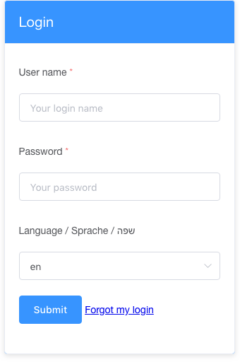
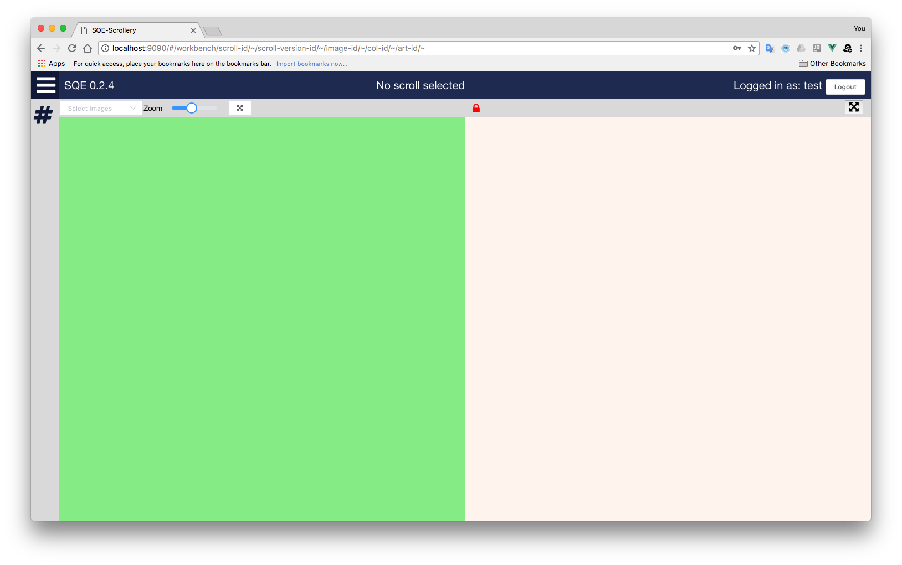
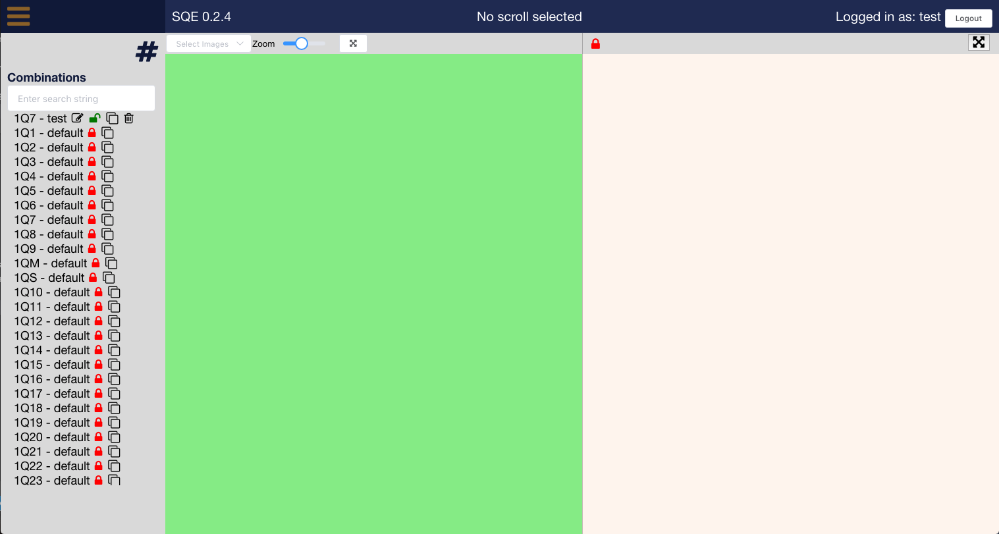
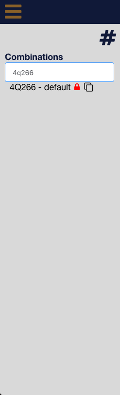
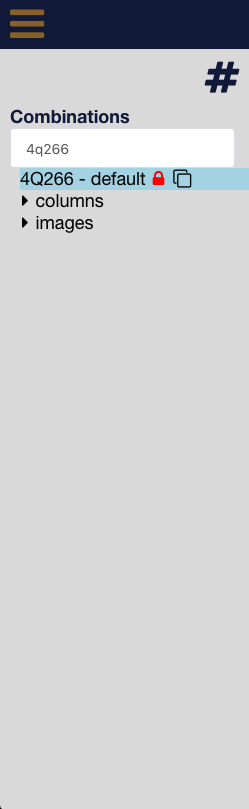
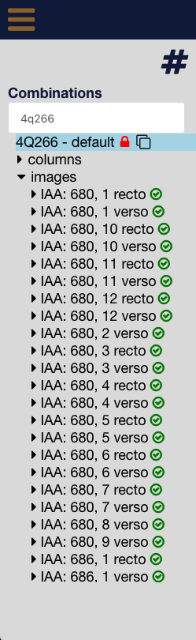

# Introduction

The scrollery website is still in heavy development and thus subject to change.  The purpose of this introduction is to provide a short introduction to the current usage and features.

## Login

The login screen has fields for username/password and a drop-down box to select your language (language support was recently updated).  You can `tab` through the fields, and hit enter or click `Submit` to execute the login.  You will receive an error message if you have entered the wrong credentials.  

If your browser is set to allow websites to store some data, then you need only login once.  The browser will store a session id that it receives from the server, and that will enable you to access the database.  We never store your password anywhere.

## Layout

Upon a successful login, you will be greeted by the scrollery proper.  There is a header at the top, which gives the version of the website you are using (this is helpful for debugging), the name of the currently selected scroll, your username, and a button to logout.  The header also has a spinning "working" icon that will appear next to your username whenever the webisite is sending data to, or receiving data from the server.  If you don't see it, then nothing is happening and the website is waiting for you to start interacting with it.

Below the header is a hideable menu on the far left, a panel for looking at images in the middle, and a panel for working with text on the far right.  The two editing panes will automatically adapt based on the selections you make in the menu.  If you do not see the editing options you were expecting in either of these panes, you have not selected the necessary item in the menu, or you are trying to work with a locked scroll.  All scrolls you see on your first login are default scrolls owned by the system, you must clone them before you can start editing (see below).

## Menu

The menu is the heart of the website.  It allows you to select scrolls and parts of scrolls (like column or artefacts).  It also provides some editing capabilities (icons are listed in order from left-to-right):

* The editing icon lets you rename an item.
* The lock icon tells you if you can edit a scroll version (it will be capable of toggling in the near future)
* The clone icon lets you create an editable copy of a scroll.
* The trash can lets you delete an item.
  
Clicking on the "hamburger icon" at the very top left will keep the menu open.  Clicking again will allow it to show/hide on mouse hover.

There is a text box at the top of the menu that lets you filter the displayed scrolls.

As you click on items, the relevant sub-items are loaded from the server.  So clicking on a scroll will reveal the possibility to see columns or imaged belonging to it.  Clicking on the little arrow before "columns" or "images" will open the respective dropdown list.

The images dropdown list shows a little green check or red x icon on each image entry letting you know whether that image is available on the NLI image server or not.  We will soon add functionality that will display a thumbnail and some metadata when you hover over the image entry.

Clicking on an image entry will open one final dropdown, which shows the artefacts that have been created in that image (there may be as many as 0–∞ artefacts for each image).

As you might expect, clicking on a column, an image, or an artefact, will cause that item to be displayed in the relevant editing pane.  Beware that we do not have a progress indicator for loading images yet and they can take some time to load.

Finally, any scroll that you are allowed to edit will have an "+ add artefact" menu selection (and soon an "+ add column" menu selection), that open a dialog box to let you do exactly what they promise (see the videos below).

## Possible interactions

In the interest of time, I put together a few demo videos to display some of the navigating and editing capabilities.  Feel free to watch and to update these docs as well!

<video width="800" height="600" controls>
  <source src="media/Scrollery-Editing-2.mp4" type="video/mp4">
Your browser does not support the video tag.
</video>

<video width="800" height="600" controls>
  <source src="media/Scrollery-Editing-3.mp4" type="video/mp4">
Your browser does not support the video tag.
</video>

<video width="800" height="600" controls>
  <source src="media/Scrollery-Editing.mp4" type="video/mp4">
Your browser does not support the video tag.
</video>